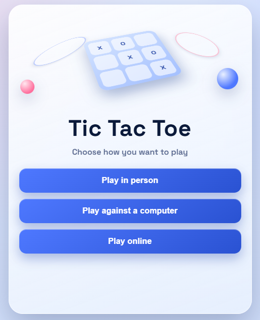
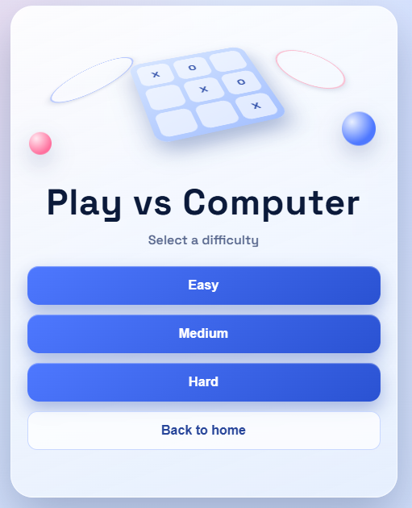
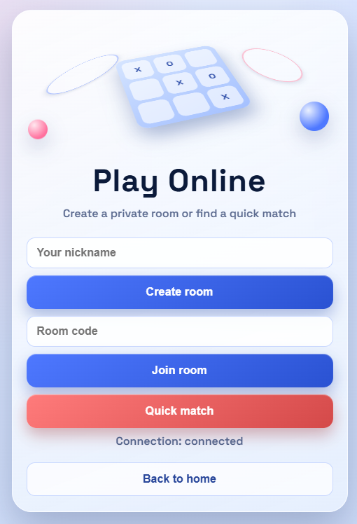
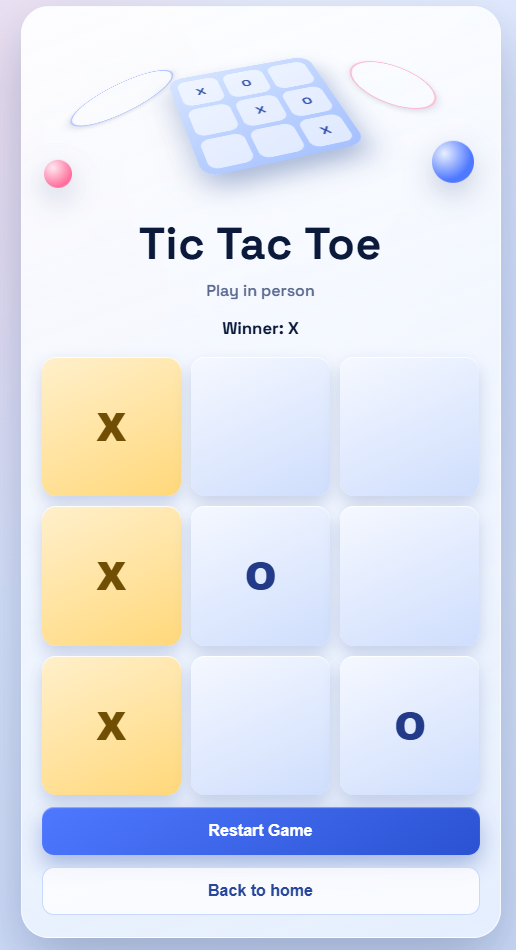

# Tic Tac Toe Online

<p align="center">
  <a href="https://playttto.netlify.app" target="_blank"></a>
  
  
  
</p>

Modern Tic Tac Toe experience with three game modes:
- **In Person** (2 players on one device)
- **vs Computer** (**Easy / Medium / Hard**)
- **Online Multiplayer** (real-time via Socket.IO)

## Play Now

**Live Link:** [https://playttto.netlify.app](https://playttto.netlify.app)

## Screenshots

> Place your screenshot files in `docs/screenshots/` with the names below.

### Home


### Computer Difficulty


### Online Lobby


### In-Person Game Board


## Demo Highlights

- Responsive UI optimized for **desktop + mobile browsers**
- Clean 3D-inspired interface with custom favicon
- Server-authoritative online gameplay
- Private room codes + quick match queue
- Reconnect grace window for online matches

## Tech Stack

### Frontend
- React 18
- Vite 5
- Vanilla CSS (responsive + touch-friendly)
- Socket.IO Client

### Backend
- Node.js (ESM)
- Express
- Socket.IO
- In-memory room/session management (v1)

## Gameplay Modes

### 1. In Person
- Two local players (`X` and `O`) alternate turns
- Win and draw detection
- Restart support

### 2. Play Against Computer
- `Easy`: random valid moves
- `Medium`: tactical logic (win/block/center/corners)
- `Hard`: minimax-based optimal play

### 3. Online Multiplayer (V1)
- Create room + share room code
- Join room by code
- Quick match pairing
- Server validates turns/moves and broadcasts state
- Restart requires both players
- 30-second reconnect grace period

## Run Locally

```bash
npm install
npm run dev
```

- Client: `http://localhost:5173`
- Server: `http://localhost:3001`

## License

Use and modify freely for personal/learning projects.